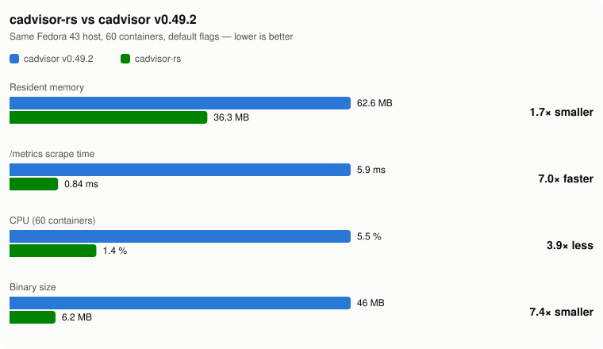

# cadvisor-rs

A reimplementation of [google/cadvisor](https://github.com/google/cadvisor) in
Rust. It reads the cgroup v2 hierarchy, procfs and sysfs. It serves the same
Prometheus `/metrics` output and the same REST API as upstream
**cadvisor v0.49.2**: `/api/v1.0`–`v1.3` and `/api/v2.0`–`v2.1`. When
containerd or CRI-O is present it adds container names, images and labels from
the runtime. It supports cgroup v2 only and runs on Linux only: on any other OS
the binary prints a message and exits 1.

On stormcos nodes it ships as a **golden** under `stormd` on port **9096** (see
[How it ships](#how-it-ships)). Elsewhere it is an RPM/DEB with a systemd unit
on upstream's default port 8080.

## What it does today

- **Discovery.** It walks `/sys/fs/cgroup` and watches it with inotify, and
  sweeps the whole tree again every `--global-housekeeping-interval` (1m) as a
  safety net. Each cgroup becomes a container named by its path (`/`,
  `/system.slice/…`, `/machine.slice/…`).
- **Stats.** Each container has its own housekeeping loop. It starts at
  `--housekeeping-interval` (1s) and, with `--allow-dynamic-housekeeping`,
  backs off to at most `--max-housekeeping-interval` (60s) while the
  container's stats stay the same. Samples are kept in an in-memory ring
  buffer for `--storage-duration` (2m). Nothing is written to disk.
- **cgroup v2 semantics**, the same as upstream on v2. `working_set` is
  `memory.current` minus `inactive_file`. `cache` is `file`, `rss` is `anon`
  and `max_usage` is `memory.peak`. `cpu.stat` µs values are converted to ns,
  and `cpu.weight` is converted back to v1 shares. `io.stat` and `pids.*` are
  read too. PSI (`*.pressure`) is not exported, because v0.49.2 does not
  export it.
- **Runtime metadata.** containerd is read over gRPC on its unix socket, using
  `containers.v1` and `tasks.v1` in `--containerd-namespace`. CRI-O is read
  over HTTP/1 on its unix socket (`GET /info`, `GET /containers/<id>`).
  Container ids are the 64-hex ids found in cgroup names (`crio-<id>.scope`,
  `cri-containerd-<id>.scope`, `libpod-<id>.scope`, …). If a socket is
  missing, those containers are monitored as raw cgroups. Only the pod sandbox
  container reports network stats, which it reads from its init PID's
  `/proc/<pid>/net`.
- **Events.** It records container creation and deletion. It also records
  `oom` + `oomKill` events whenever `memory.events` `oom_kill` goes up. Events
  are served on `/api/v1.3/events` and `/api/v2.x/events`.
- **Not implemented:** TLS and auth (#4; the server is plain HTTP),
  `--env-metadata-whitelist` (#10), protobuf responses, and upstream's
  default-disabled metric groups (tcp/udp/advtcp, sched, hugetlb, perf,
  resctrl, …). The names of those groups are accepted in the flags and emit
  nothing, which is what a default upstream build does.

## Endpoints

All of these are served on one HTTP listener (`--listen-ip`:`--port`).

| Path | What |
|---|---|
| `/healthz`, `/-/healthy`, `/-/ready` | Always `200 ok` once the listener is up. These do not check the collectors. `stormd` probes `/healthz`. |
| `/metrics` | Prometheus text format 0.0.4, byte-compatible with v0.49.2 at default flags: family names, HELP/TYPE lines, label sets, Go float formatting and per-sample timestamps. |
| `/api`, `/api/` | `400`, listing the supported API versions (`v1.0,v1.1,v1.2,v1.3,v2.0,v2.1`). |
| `/api/v1.x/machine`, `/containers/<name>` | v1.0+ |
| `/api/v1.x/subcontainers/<name>` | v1.1+ |
| `/api/v1.x/docker/<id>` | v1.2+. Answered from containerd/CRI-O metadata (see below). |
| `/api/v1.3/events/<name>?…` | v1.3. Takes the upstream query parameters: `all_events`, `oom_events`, `oom_kill_events`, `creation_events`, `deletion_events`, `max_events` (default 10), `start_time`, `end_time`, `subcontainers`, and `stream=true` (newline-delimited JSON). |
| `/api/v2.x/{version,machine,attributes,stats,spec,summary,ps,storage,events,appmetrics}` | v2.0/v2.1. `v2.1/machinestats` is also served. `appmetrics` always returns `{}`. |

Errors follow upstream's contract. A lookup failure is a plain-text `500`
(`failed to get container "/x" with error: …`). The two "Supported …" listing
responses are `400`. Everything else is JSON `200`.

**Deliberate deviation:** upstream answers the `docker` request types with an
empty result or an error when there is no dockershim. cadvisor-rs answers them
from containerd/CRI-O metadata instead.

## Configuration

It is configured by flags only: there is no config file, and there are no
environment variables apart from `RUST_LOG`. Log level comes from `RUST_LOG`
(tracing `EnvFilter` syntax, default `info`), and logs go to stderr.

Go-style single-dash flags are accepted (`-port 8080` is read as
`--port 8080`). **The flag names are the kebab-case names below, not
upstream's underscore names.** `-listen_ip` is currently rejected (#9). Durations
use humantime syntax (`1s`, `1m0s`, `2m`). Booleans take a value
(`--store-container-labels=false`).

| Flag | Default | Effect |
|---|---|---|
| `--listen-ip` | `""` (all interfaces, `0.0.0.0`) | Bind address |
| `--port` | `8080` | Bind port |
| `--housekeeping-interval` | `1s` | Starting per-container stats interval |
| `--max-housekeeping-interval` | `60s` | Longest interval dynamic backoff reaches |
| `--allow-dynamic-housekeeping` | `true` | Back off idle containers |
| `--global-housekeeping-interval` | `1m0s` | Full cgroup-tree rediscovery sweep |
| `--storage-duration` | `2m0s` | How long samples stay in the in-memory ring buffer |
| `--disable-metrics` | `""` | Comma-separated metric groups to leave out of `/metrics` |
| `--enable-metrics` | `""` | If set, only these groups are emitted. It overrides `--disable-metrics`. |
| `--store-container-labels` | `true` | Export every runtime label as a `container_label_*` Prometheus label |
| `--whitelisted-container-labels` | `""` | Labels to export when `--store-container-labels=false` |
| `--env-metadata-whitelist` | `""` | **Accepted and ignored** (#10) |
| `--containerd` | `/run/containerd/containerd.sock` | containerd socket |
| `--containerd-namespace` | `k8s.io` | containerd namespace |
| `--crio` | `/var/run/crio/crio.sock` | CRI-O socket |

These metric group names change the output: `cpu`, `cpuLoad`, `memory`,
`disk` (fs usage, limits and inodes), `diskIO` (the other `container_fs_*` and
`container_blkio_*` families) and `network`. The cpu and memory spec
families follow their group. `cadvisor_version_info`, `container_start_time_seconds`,
`container_last_seen` and the `machine_*` families are always emitted. The groups `percpu`, `app`, `perf_event`, `oom_event` and
`pressure` are in the `--enable-metrics` universe too. When
`--enable-metrics` is set, every group in that list that you do not name is
disabled.

It needs read access to the whole cgroup v2 tree, to every container's
`/proc/<pid>`, and to the runtime sockets. In practice that means root, or on
stormcos, the `host` profile with the pid and uts namespaces shared.

## Ports

| Where | Port | Source |
|---|---|---|
| Upstream / RPM default | 8080 | `--port` default |
| stormcos node | 9096 | `argv = ["--port", "9096", "--listen-ip", "0.0.0.0"]` in `stormcentral/components/stormcos.toml` and `stormcos/deploy/build-goldens.sh`. 9095 belongs to stormvm. |
| stormcos ingress | `cadvisor.storm1.g8.lo` → `127.0.0.1:9096` | HTTPRoute in `stormcos/deploy/manifests/85-routes.yaml`, served by stormlb |

## How it ships

**As a stormcos golden.** cadvisor is a `kind = "service"` component in
`stormcentral/components/stormcos.toml`. stormcos's
`deploy/build-goldens.sh` (`service_golden`) builds it with
`cargo build --release --target x86_64-unknown-linux-musl`. It puts the static
binary at `/usr/sbin/cadvisor` in a `stormdbase` root under `stormd`, with a
`/healthz` probe and the argv above. The build produces three goldens:
`cadvisor` (32M, system1 pallet), `cadvisor-logs` (system1) and
`cadvisor-data` (data1, mounted at `/var/lib/cadvisor`). The node's
`boot.d/40-services` has `start cadvisor`. The container spec shares the pid
and uts namespaces and uses the `host` profile, so it sees every cgroup
stormpump writes, not only the ones a runtime knows about.

**[`stormcos/docs/goldens.md`](https://github.com/glennswest/stormcos/blob/main/docs/goldens.md)
is the authority for how goldens are built.** What that means here:

- A commit does not reach a node until a new golden is built. Request one with
  `stormcentral component build cadvisor --url http://stormcentral.g8.lo`
  after the work is pushed and `sc-build` passes. After that, a release has to
  be composed.
- Sibling crates come from `Cargo.lock`. A fix in a dependency does not arrive
  until `cargo update`.
- The golden is a musl build of Linux-only code, so it has to be built on dev,
  never on macOS.

**As an RPM/DEB** for hosts that are not stormcos. `deploy/packaging/nfpm.yaml`
makes the `cadvisor-rs` package. It contains `/usr/bin/cadvisor`, the
`cadvisor.service` unit (runs as root, `ProtectSystem=strict`, not enabled on
install) and `/etc/cadvisor/cadvisor`, an `EnvironmentFile` with
`CADVISOR_ARGS=`:

```sh
dnf install cadvisor-rs-<version>.x86_64.rpm   # or: dpkg -i cadvisor-rs_<version>_amd64.deb
systemctl enable --now cadvisor
```

## Building and testing

Builds run on `dev.g8.lo` through `sc-build`, never as root, and never on the
stormcentral VM. Commit and push first, because `sc-build` builds the pushed
commit in a scratch directory and then deletes it:

```sh
sc-build                                          # cargo build && cargo test
sc-build 'cargo test -p cadvisor-metrics'         # any command
sc-build 'cargo run -p cadvisor-host --example dump machine'
```

- The parsers take `&str`, so `cargo test` covers them on any OS. The data
  plane (`CgroupReader`, `FsService`, `machine_info`, `watch`), the manager,
  the API and the metrics router are `cfg(target_os = "linux")`. A macOS build
  skips them.
- Wire format: `crates/cadvisor-model/fixtures/` holds responses captured from
  v0.49.2. The golden tests round-trip every fixture byte for byte.
  `crates/cadvisor-host/fixtures/` holds cgroup/proc files from a Fedora 43 host.
- Conformance: run real cadvisor v0.49.2 (`REF`, default `:18080`) and
  cadvisor-rs (`OURS`, default `:18081`) on the same host. Then run
  `conformance/diff-metrics.sh` (a normalized `/metrics` diff) and
  `conformance/diff-api.py` (a JSON key-path and type diff over 15 endpoints).
  As of 2026-07-16 they were conformant on plain-cgroup, containerd and CRI-O
  hosts.
- Runtime test VM: `deploy/terragrunt/runtime-test/` provisions a Fedora VM
  with containerd and CRI-O on the g8 Proxmox. Get a vm_id from
  `deploy/terragrunt/free-vmid.sh` first, and run `terragrunt destroy` when
  you are done.
- The Makefile's `sync`, `test-linux`, `build-linux` and `package` targets
  predate `sc-build`. They rsync to `root@dev.g8.lo`, so do not use them (#11).

## Crates

| Crate | Role |
|---|---|
| `cadvisor` | The binary: flags, the metric-group rules, the axum server, health routes and graceful shutdown on SIGINT. SIGTERM ends the process without draining. |
| `cadvisor-model` | v1/v2/machine/event wire types with Go-compatible serde. Keeps upstream's JSON typos. |
| `cadvisor-host` | cgroup v2, procfs and sysfs readers, filesystem stats, machine info, inotify watch |
| `cadvisor-runtime` | containerd (gRPC) and CRI-O (unix-socket HTTP) metadata clients, container-id extraction |
| `cadvisor-manager` | Container registry, `TimedStore` ring buffer, adaptive housekeeping, discovery, events, runtime enrichment |
| `cadvisor-metrics` | Hand-written Prometheus exposition. There is no registry, and it renders in one pass into a reused buffer. |
| `cadvisor-api` | The v1/v2 REST dispatch, with upstream's routing and error contract |

## Performance

Measured side by side against cadvisor v0.49.2 on 2026-07-16: same Fedora 43
host, 60 busybox containers (~130 cgroups), default flags, release build.

<picture>
  <source media="(prefers-color-scheme: dark)" srcset="docs/perf-dark.svg">
  
</picture>

| | cadvisor v0.49.2 | cadvisor-rs | |
|---|---|---|---|
| Resident memory | 62.6 MB | **36.3 MB** | 1.7× smaller |
| /metrics scrape (avg of 10) | 5.9 ms | **0.84 ms** | 7.0× faster |
| CPU (30s window incl. scrapes) | 5.5 % | **1.4 %** | 3.9× less |
| Binary size | 46 MB | **6.2 MB** | 7.4× smaller |

These numbers are from the glibc release build of 2026-07-16. They were not
re-measured for the musl golden build.
