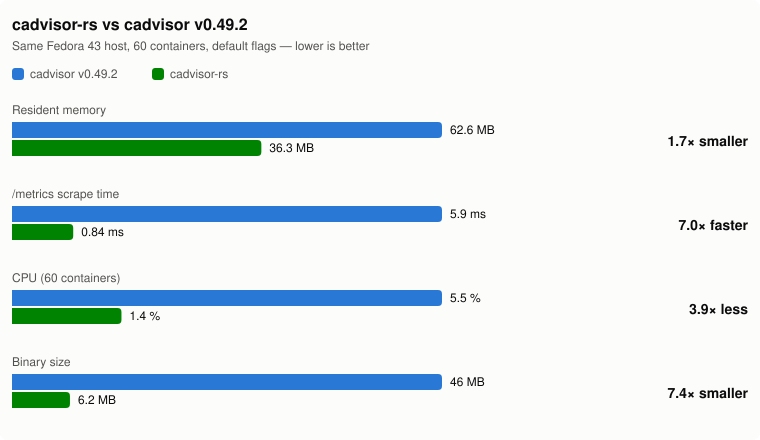

# cadvisor-rs

A reimplementation of [google/cadvisor](https://github.com/google/cadvisor) in
Rust. It reads the cgroup v2 hierarchy, procfs and sysfs. It serves the same
Prometheus `/metrics` output and the same REST API as upstream
**cadvisor v0.49.2**: `/api/v1.0`–`v1.3` and `/api/v2.0`–`v2.1`. When
containerd or CRI-O is present it adds container names, images and labels from
the runtime. It supports cgroup v2 only and runs on Linux only: on any other OS
the binary prints a message and exits 1.

On stormcos nodes it ships as a **golden** under `stormd` on port **9096** (see
[How it ships](#how-it-ships)). Elsewhere it is an RPM/DEB with a systemd unit
on upstream's default port 8080.

A slide deck on its purpose and functionality is in
[`docs/presentation.md`](docs/presentation.md) (Marp: `npx @marp-team/marp-cli docs/presentation.md`).

## What it does today

- **Discovery.** It walks `/sys/fs/cgroup` and watches it with inotify, and
  sweeps the whole tree again every `--global-housekeeping-interval` (1m) as a
  safety net. Each cgroup becomes a container named by its path (`/`,
  `/system.slice/…`, `/machine.slice/…`).
- **Stats.** Each container has its own housekeeping loop. It starts at
  `--housekeeping-interval` (1s) and, with `--allow-dynamic-housekeeping`,
  backs off to at most `--max-housekeeping-interval` (60s) while the
  container's stats stay the same. Samples are kept in an in-memory ring
  buffer for `--storage-duration` (2m). Nothing is written to disk.
- **cgroup v2 semantics**, the same as upstream on v2. `working_set` is
  `memory.current` minus `inactive_file`. `cache` is `file`, `rss` is `anon`
  and `max_usage` is `memory.peak`. `cpu.stat` µs values are converted to ns,
  and `cpu.weight` is converted back to v1 shares. `io.stat` and `pids.*` are
  read too. PSI (`*.pressure`) is not exported, because v0.49.2 does not
  export it.
- **Runtime metadata.** containerd is read over gRPC on its unix socket, using
  `containers.v1` and `tasks.v1` in `--containerd-namespace`. CRI-O is read
  over HTTP/1 on its unix socket (`GET /info`, `GET /containers/<id>`).
  Container ids are the 64-hex ids found in cgroup names (`crio-<id>.scope`,
  `cri-containerd-<id>.scope`, `libpod-<id>.scope`, …). If a socket is
  missing, those containers are monitored as raw cgroups. Only the pod sandbox
  container reports network stats, which it reads from its init PID's
  `/proc/<pid>/net`.
- **stormcos pods have no metadata.** On stormcos, pods run under stormpump,
  not containerd or CRI-O. cadvisor has no client for stormpump, and stormpump
  names their cgroups opaquely (`/stormpump/w<tag>-<n>`). So those containers
  are raw cgroups with only the `id` label: no `name`, `image` or
  `container_label_*` (#3).
- **Events.** It records container creation and deletion. It also records
  `oom` + `oomKill` events whenever `memory.events` `oom_kill` goes up. Events
  are served on `/api/v1.3/events` and `/api/v2.x/events`.
- **Machine info is re-read every `-update_machine_info_interval`** (5m, as
  upstream): CPU topology, memory, filesystems, NICs and the disk map
  (`major:minor` → device name). The disk map is also re-scanned as soon as a
  container's `io.stat` names a device it lacks, once per new device, so a
  volume attached after startup (a stormblock ublk / nvme-tcp volume) is named
  `/dev/<name>` on its next sample rather than `device=""` (#18). Devices
  `/sys/block` filters out (`loop*`, `ram*`, `sr*`, `fd*`) stay `device=""`,
  as upstream.
- **TLS and bearer tokens (optional, #4).** Off by default, as upstream.
  See [TLS and auth](#tls-and-auth).
- **Not implemented:** `--env-metadata-whitelist` (#10), protobuf responses, and upstream's
  default-disabled metric groups (tcp/udp/advtcp, sched, hugetlb, perf,
  resctrl, …). The names of those groups are accepted in the flags and emit
  nothing, which is what a default upstream build does.

## Endpoints

All of these are served on one listener (`--listen-ip`:`--port`). It is plain
HTTP, or HTTPS only when `--tls-cert-file` is set. With
`--bearer-token-file`, every path except the three health paths needs a token
([TLS and auth](#tls-and-auth)).

| Path | What |
|---|---|
| `/healthz`, `/-/healthy`, `/-/ready` | Always `200 ok` once the listener is up. These do not check the collectors. `stormd` probes `/healthz`. |
| `/metrics` | Prometheus text format 0.0.4, byte-compatible with v0.49.2 at default flags: family names, HELP/TYPE lines, label sets, Go float formatting and per-sample timestamps. A series is never repeated. When two samples would share a name and labels (two `io.stat` devices missing from the disk map both get `device=""`), the first is served, as upstream's client_golang does (#14). |
| `/api`, `/api/` | `400`, listing the supported API versions (`v1.0,v1.1,v1.2,v1.3,v2.0,v2.1`). |
| `/api/v1.x/machine`, `/containers/<name>` | v1.0+ |
| `/api/v1.x/subcontainers/<name>` | v1.1+ |
| `/api/v1.x/docker/<id>` | v1.2+. Answered from containerd/CRI-O metadata (see below). |
| `/api/v1.3/events/<name>?…` | v1.3. Takes the upstream query parameters: `all_events`, `oom_events`, `oom_kill_events`, `creation_events`, `deletion_events`, `max_events` (default 10), `start_time`, `end_time`, `subcontainers`, and `stream=true` (newline-delimited JSON). |
| `/api/v2.x/{version,machine,attributes,stats,spec,summary,ps,storage,events,appmetrics}` | v2.0/v2.1. `v2.1/machinestats` is also served. `appmetrics` always returns `{}`. |

Errors follow upstream's contract. A lookup failure is a plain-text `500`
(`failed to get container "/x" with error: …`). The two "Supported …" listing
responses are `400`. Everything else is JSON `200`.

**Deliberate deviation:** upstream answers the `docker` request types with an
empty result or an error when there is no dockershim. cadvisor-rs answers them
from containerd/CRI-O metadata instead.

## Configuration

It is configured by flags only: there is no config file, and there are no
environment variables apart from `RUST_LOG`. Log level comes from `RUST_LOG`
(tracing `EnvFilter` syntax, default `info`), and logs go to stderr.

The flag names are upstream's (#9): an upstream command line such as
`cadvisor -listen_ip 0.0.0.0 -housekeeping_interval 10s` works as is. Every
flag also answers to the other spelling (`--listen-ip`,
`--containerd_namespace`, `--tls_cert_file`), so existing kebab-case command
lines, including the stormcos golden's `--listen-ip`, keep working. Go-style
single-dash flags are accepted (`-port 8080` is read as `--port 8080`).
Durations use humantime syntax (`1s`, `1m0s`, `2m`). Booleans take a value
(`-store_container_labels=false`); given bare (`-store_container_labels`) they
mean `true`, as in Go.

| Flag (upstream spelling) | Default | Effect |
|---|---|---|
| `-listen_ip` | `""` (all interfaces, `0.0.0.0`) | Bind address |
| `-port` | `8080` | Bind port |
| `-housekeeping_interval` | `1s` | Starting per-container stats interval |
| `-max_housekeeping_interval` | `60s` | Longest interval dynamic backoff reaches |
| `-allow_dynamic_housekeeping` | `true` | Back off idle containers |
| `-global_housekeeping_interval` | `1m0s` | Full cgroup-tree rediscovery sweep |
| `-storage_duration` | `2m0s` | How long samples stay in the in-memory ring buffer |
| `-update_machine_info_interval` | `5m0s` | How often machine info (disk map, filesystems, NICs, memory) is re-read |
| `-disable_metrics` | `""` | Comma-separated metric groups to leave out of `/metrics` |
| `-enable_metrics` | `""` | If set, only these groups are emitted. It overrides `-disable_metrics`. |
| `-store_container_labels` | `true` | Export every runtime label as a `container_label_*` Prometheus label |
| `-whitelisted_container_labels` | `""` | Labels to export when `-store_container_labels=false` |
| `-env_metadata_whitelist` | `""` | **Accepted and ignored** (#10) |
| `-containerd` | `/run/containerd/containerd.sock` | containerd socket |
| `-containerd-namespace` | `k8s.io` | containerd namespace |
| `-crio` | `/var/run/crio/crio.sock` | CRI-O socket |
| `--tls-cert-file` | `""` (plain HTTP) | PEM certificate chain, leaf first. With it the port speaks HTTPS only. Needs `--tls-key-file`. Not in upstream. |
| `--tls-key-file` | `""` | PEM private key for `--tls-cert-file` |
| `--bearer-token-file` | `""` (no auth) | Accepted tokens, one per line, `#` comments. Not in upstream. |

These metric group names change the output: `cpu`, `cpuLoad`
(`container_cpu_load_*` and `container_tasks_state`), `memory`,
`disk` (fs usage, limits and inodes), `diskIO` (the other `container_fs_*` and
`container_blkio_*` families), `network` and `oom_event`
(`container_oom_events_total`). The cpu and memory spec
families follow their group. `cadvisor_version_info`, `container_start_time_seconds`,
`container_last_seen` and the `machine_*` families are always emitted. The groups `percpu`, `app`, `perf_event` and
`pressure` are in the `--enable-metrics` universe too and emit nothing. When
`--enable-metrics` is set, every group in that list that you do not name is
disabled.

It needs read access to the whole cgroup v2 tree, to every container's
`/proc/<pid>`, and to the runtime sockets. In practice that means root, or on
stormcos, the `host` profile with the pid and uts namespaces shared.

## TLS and auth

Upstream cadvisor has neither. This is an addition for stormcos, where every
node API is TLS with a stormcert-issued certificate and authenticated
(stormcos#81; the owner's decision is #17).

- **TLS**: `--tls-cert-file` + `--tls-key-file`, PEM. With them the port
  serves HTTPS only (rustls, ring; TLS 1.2 and 1.3; ALPN `h2`, `http/1.1`).
  Setting one without the other is a startup error, and so is a certificate
  and key that do not match.
- **Bearer tokens**: `--bearer-token-file`. Any path other than `/healthz`,
  `/-/healthy` and `/-/ready`, including unknown paths, returns `401` with
  `WWW-Authenticate: Bearer` unless the request has
  `Authorization: Bearer <token>` for a token in the file. Tokens are
  compared in constant time. A file with no tokens is a startup error. A
  token file without TLS is allowed, with a warning, since the tokens then
  cross the network in clear.
- **The health paths stay anonymous**: stormd's liveness probe sends no token.
  It does speak https, and accepts any certificate.
- **Rotation without a restart**: the certificate, key and token files are
  re-read when their mtime, size or inode changes, checked at most every 5 s.
  A replacement that fails to load is logged, the previous one stays in use,
  and it is retried. That covers stormcert-agent's renewal, which renames the
  new key into place before the new certificate, so for a moment the pair does
  not match.
- **Shutdown**: on SIGINT the TLS listener stops accepting and in-flight
  connections are not drained (the plain listener drains them).

Tested end to end by `crates/cadvisor/tests/tls_auth.rs`. It starts the real
binary with a generated certificate and checks: no plaintext answer, `401`
without or with a wrong token, `200` with one, health without one, a rotated
token file, and a key-then-certificate renewal.

On stormcos these are not turned on yet. The golden needs a certificate
minted for cadvisor, a token file for its scrapers, and an https liveness URL
(stormcos#143, which also drops the anonymous `cadvisor.storm1.g8.lo` route
meanwhile).

## Ports

| Where | Port | Source |
|---|---|---|
| Upstream / RPM default | 8080 | `--port` default |
| stormcos node | 9096 | `argv = ["--port", "9096", "--listen-ip", "0.0.0.0"]` in `stormcentral/components/stormcos.toml` and `stormcos/deploy/build-goldens.sh`. 9095 belongs to stormvm. |
| stormcos ingress | `cadvisor.storm1.g8.lo` → `127.0.0.1:9096` | HTTPRoute in `stormcos/deploy/manifests/85-routes.yaml`, served by stormlb. It is unauthenticated, and stormcos#143 drops it. stormlb cannot reach a TLS-only backend (stormlb#13). |

## How it ships

**As a stormcos golden.** cadvisor is a `kind = "service"` component in
`stormcentral/components/stormcos.toml`. stormcos's
`deploy/build-goldens.sh` (`service_golden`) builds it with
`cargo build --release --target x86_64-unknown-linux-musl`. It puts the static
binary at `/usr/sbin/cadvisor` in a `stormdbase` root under `stormd`, with a
`/healthz` probe and the argv above. The build produces three goldens:
`cadvisor` (32M, system1 pallet), `cadvisor-logs` (system1) and
`cadvisor-data` (data1, mounted at `/var/lib/cadvisor`). The node's
`boot.d/40-services` has `start cadvisor`. The container spec shares the pid
and uts namespaces and uses the `host` profile, so it sees every cgroup
stormpump writes, not only the ones a runtime knows about.

**[`stormcos/docs/goldens.md`](https://github.com/glennswest/stormcos/blob/main/docs/goldens.md)
is the authority for how goldens are built.** What that means here:

- A commit does not reach a node until a new golden is built. Request one with
  `stormcentral component build cadvisor --url http://stormcentral.g8.lo`
  after the work is pushed and `sc-build` passes. After that, a release has to
  be composed.
- Sibling crates come from `Cargo.lock`. A fix in a dependency does not arrive
  until `cargo update`.
- The golden is a musl build of Linux-only code, so it has to be built on dev,
  never on macOS.

**As an RPM/DEB** for hosts that are not stormcos. `deploy/packaging/nfpm.yaml`
makes the `cadvisor-rs` package. It contains `/usr/bin/cadvisor`, the
`cadvisor.service` unit (runs as root, `ProtectSystem=strict`, not enabled on
install) and `/etc/cadvisor/cadvisor`, an `EnvironmentFile` with
`CADVISOR_ARGS=`:

```sh
dnf install cadvisor-rs-<version>.x86_64.rpm   # or: dpkg -i cadvisor-rs_<version>_amd64.deb
systemctl enable --now cadvisor
```

## Building and testing

Builds run on `dev.g8.lo` through `sc-build`, never as root, and never on the
stormcentral VM. Commit and push first, because `sc-build` builds the pushed
commit in a scratch directory and then deletes it:

```sh
sc-build                                          # cargo build && cargo test
sc-build 'cargo test -p cadvisor-metrics'         # any command
sc-build 'cargo run -p cadvisor-host --example dump machine'
```

The test container's crate (`test/`) is its own cargo workspace, so the
default `sc-build` does not build it. To run its unit tests and harness:

```sh
sc-build 'T=$(cargo metadata --format-version 1 --no-deps | sed "s/.*\"target_directory\":\"\([^\"]*\)\".*/\1/"); cargo build -p cadvisor && cd test && CADVISOR_BIN=$T/debug/cadvisor cargo test --locked'
```

- The parsers take `&str`, so `cargo test` covers them on any OS. The data
  plane (`CgroupReader`, `FsService`, `machine_info`, `watch`), the manager,
  the API and the metrics router are `cfg(target_os = "linux")`. A macOS build
  skips them.
- Wire format: `crates/cadvisor-model/fixtures/` holds responses captured from
  v0.49.2. The golden tests round-trip every fixture byte for byte.
  `crates/cadvisor-host/fixtures/` holds cgroup/proc files from a Fedora 43 host.
- Conformance: run real cadvisor v0.49.2 (`REF`, default `:18080`) and
  cadvisor-rs (`OURS`, default `:18081`) on the same host. Then run
  `conformance/diff-metrics.sh` (a normalized `/metrics` diff) and
  `conformance/diff-api.py` (a JSON key-path and type diff over 15 endpoints).
  As of 2026-07-16 they were conformant on plain-cgroup, containerd and CRI-O
  hosts.
- Runtime test VM: `deploy/terragrunt/runtime-test/` provisions a Fedora VM
  with containerd and CRI-O on the g8 Proxmox. Get a vm_id from
  `deploy/terragrunt/free-vmid.sh` first, and run `terragrunt destroy` when
  you are done.
- Makefile: `make test` (unit tests), `make conformance` (runs both diffs
  above against already-running REF and OURS), `make package` (release build,
  then `.rpm` + `.deb` into `dist/` with nfpm). Every target runs where it is
  invoked. From a stormcentral session, run them through sc-build, e.g.
  `sc-build 'make package'` (#11).

## Tests on a node

`test/` holds cadvisor's test container, per stormcentral's
[`docs/test-standard.md`](https://github.com/glennswest/stormcentral/blob/main/docs/test-standard.md).
stormcentral builds it (`test/build.sh`, then `podman build -f
test/Containerfile .`) and runs it as a Job on each test machine:
`stormcentral test run cadvisor short|medium|long`. It has one image, whose
program is `/test <suite>`. It writes one JSON line per test and exits 0
(passed), 1 (a test failed) or 2 (could not run).

| Suite | Budget | What it checks |
|---|---|---|
| `short` | < 2 min | `/healthz` and the other health paths; stormd reports cadvisor running (`:9196`); version; machine (API and `/metrics` agree); `/metrics` parses strictly (no duplicate series, a TYPE for every family, timestamps on stats); housekeeping keeps producing samples. Then one workload pod is found, its CPU and memory are reported, and it is gone after the delete. |
| `medium` | < 30 min | The short checks again. Every v1/v2 endpoint's shape, the `400` listings and the upstream-worded `500` errors. 16 concurrent scrapes. Creation and deletion events, streamed and in the history. OOM kills, as `oom` + `oomKill` events and `container_oom_events_total`. Accuracy against half a core and 128 MiB, with `/metrics` agreeing with the API. One container per core (4–16), all found and all let go. stormd counts no restart. |
| `long` | the night | Waves of workload containers sized from the machine: two per core, at most a quarter of memory, 4–128. Per wave it records discovery latency, scrape time, drain time, containers left over, and cadvisor's own RSS and fds. The `trend` test fails on a slowdown or on residue that grows. |

How it works on a node:

- **Workloads are this image.** The suites start pods in the run's
  namespace running `/test workload <marker> cpu=… mem=… secs=…`, pinned to the
  Job's node. The image name comes from reading the Job's own pod.
- **A workload is found through cadvisor.** stormpump names pod cgroups
  opaquely (`/stormpump/w<tag>-<n>`), so the suite looks for the new container
  whose `/api/v2.0/ps` shows the marker.
- **Nothing cluster-scoped.** The runner's Role covers only the run's
  namespace, so waves are sized from cadvisor's `/api/v2.0/machine`, not from
  `nodes`.
- **Skips.** `accuracy` needs at least two cores. `oom` is skipped when the
  runtime applies no pod memory limit. VM waves belong to stormvm's suite.
  `test/cadvisor-test.yaml` has the full metadata.

On the build box, `cd test && CADVISOR_BIN=<path to cadvisor> cargo test`
runs the unit tests. It also runs `tests/harness.rs`, which starts the real
binary and runs `short` and `medium` against it, with the pod tests skipped.

**Status (2026-09-28):** the suites are verified on the build box: unit
tests, the harness, and the image built by `test/build.sh` and podman. No node
run has passed yet. C2NR0Q2, the only test machine, answers on its registry
port (:5100) again. The furthest run (stormcentral `fe3fc66b32`) got as far as
the image push and hit a broken pipe there (stormblock-registry#56, fixed in
v0.24.1; not yet confirmed on C2NR0Q2). #12 stays open until a node run passes.

The suites talk plain HTTP and send no token. Once the golden turns on TLS
and auth (stormcos#143), they have to speak https with a token (#19).

## Crates

| Crate | Role |
|---|---|
| `cadvisor` | The binary: flags, the metric-group rules, the axum server, health routes and graceful shutdown on SIGINT. SIGTERM ends the process without draining. |
| `cadvisor-model` | v1/v2/machine/event wire types with Go-compatible serde. Keeps upstream's JSON typos. |
| `cadvisor-host` | cgroup v2, procfs and sysfs readers, filesystem stats, machine info, inotify watch |
| `cadvisor-runtime` | containerd (gRPC) and CRI-O (unix-socket HTTP) metadata clients, container-id extraction |
| `cadvisor-manager` | Container registry, `TimedStore` ring buffer, adaptive housekeeping, discovery, events, runtime enrichment |
| `cadvisor-metrics` | Hand-written Prometheus exposition. There is no registry, and it renders in one pass into a reused buffer. A repeated series is dropped, first wins (#14). |
| `cadvisor-api` | The v1/v2 REST dispatch, with upstream's routing and error contract |
| `cadvisor-test` (`test/`, own workspace) | The test container: `/test short\|medium\|long` and `/test workload` (see [Tests on a node](#tests-on-a-node)). It is not part of the shipped binary. |

## Performance

Measured side by side against cadvisor v0.49.2 on 2026-07-16: same Fedora 43
host, 60 busybox containers (~130 cgroups), default flags, release build.

<picture>
  <source media="(prefers-color-scheme: dark)" srcset="docs/perf-dark.svg">
  
</picture>

| | cadvisor v0.49.2 | cadvisor-rs | |
|---|---|---|---|
| Resident memory | 62.6 MB | **36.3 MB** | 1.7× smaller |
| /metrics scrape (avg of 10) | 5.9 ms | **0.84 ms** | 7.0× faster |
| CPU (30s window incl. scrapes) | 5.5 % | **1.4 %** | 3.9× less |
| Binary size | 46 MB | **6.2 MB** | 7.4× smaller |

These numbers are from the glibc release build of 2026-07-16. They were not
re-measured for the musl golden build.
